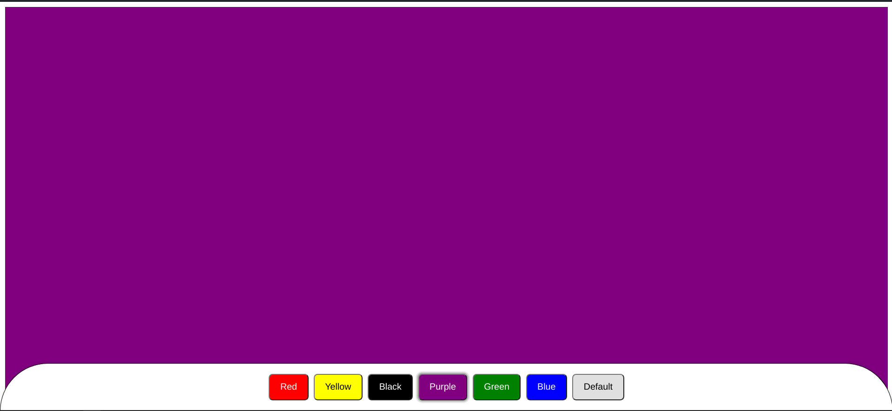

# Background Changer

This project is a simple React application that allows users to change the background color of the page. It's built with React and Vite, showcasing the use of state management in React and providing a minimal setup for rapid development with hot module replacement (HMR).

## Features

- Change the background color of the page by clicking buttons.
- Demonstrates the use of React state and event handling.
- Utilizes Vite for a fast development experience.

## Getting Started

To get started with this project, clone the repository and install the dependencies:

```bash
git clone https://github.com/nimeshthakur0/background-changer.git
cd background-changer
npm install
```

To run the project in development mode:

```bash
npm run dev
```

## How It Works

The application uses the `useState` hook to manage the background color state. Buttons are rendered for each color option, and clicking a button updates the state, thus changing the background color.

## Screenshots

<!-- Add your screenshots here -->


## Built With

- [React](https://reactjs.org/) - A JavaScript library for building user interfaces.
- [Vite](https://vitejs.dev/) - A build tool that aims to provide a faster and leaner development experience for modern web projects.

## Plugins Used

- [@vitejs/plugin-react](https://github.com/vitejs/vite-plugin-react/blob/main/packages/plugin-react/README.md) for Fast Refresh with React.
- [@vitejs/plugin-react-swc](https://github.com/vitejs/vite-plugin-react-swc) for utilizing SWC with React.

## Contributing

Contributions are welcome! Please feel free to submit a pull request.

## License

This project is licensed under the MIT License - see the [LICENSE](LICENSE) file for details.
